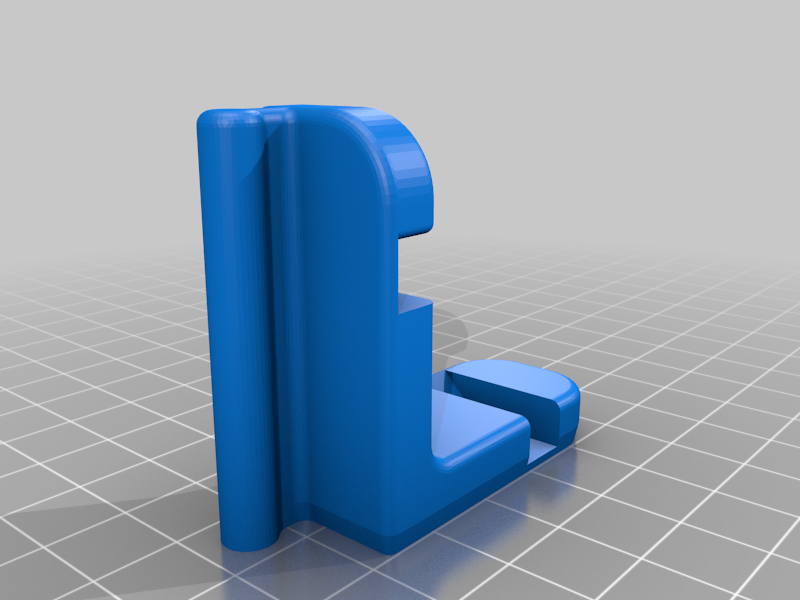
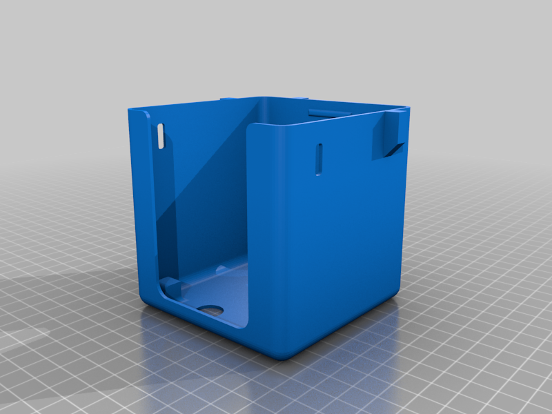
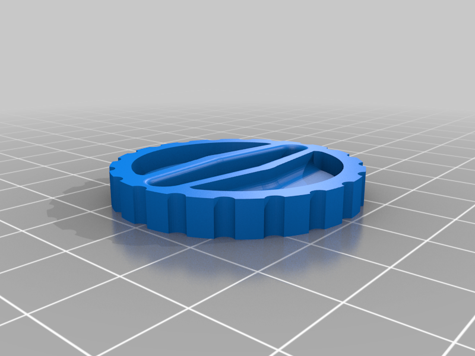
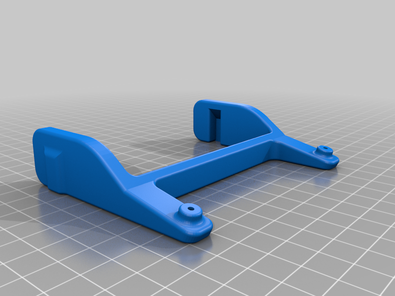
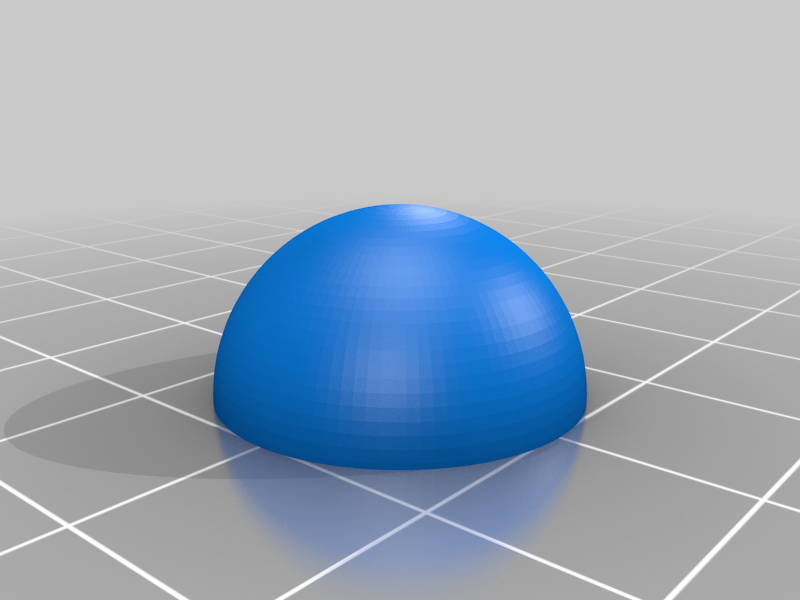
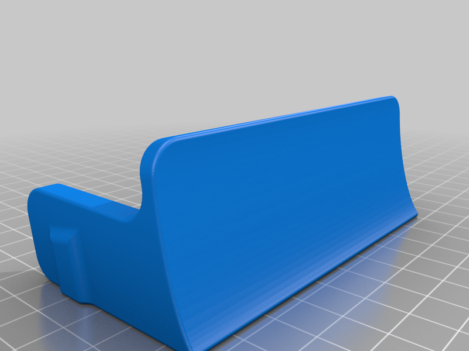
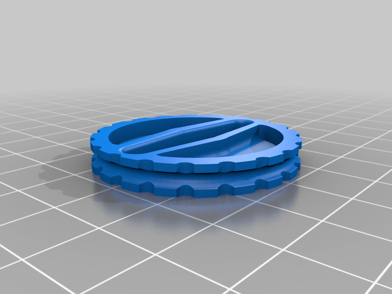
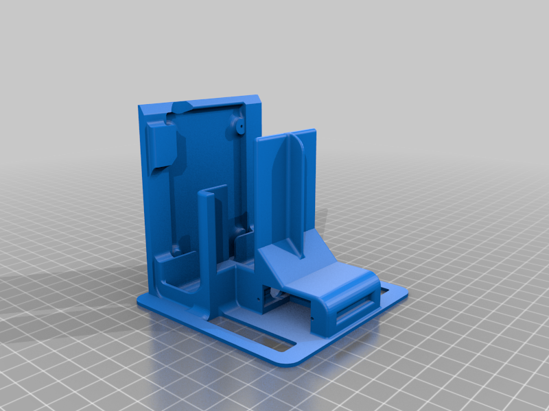
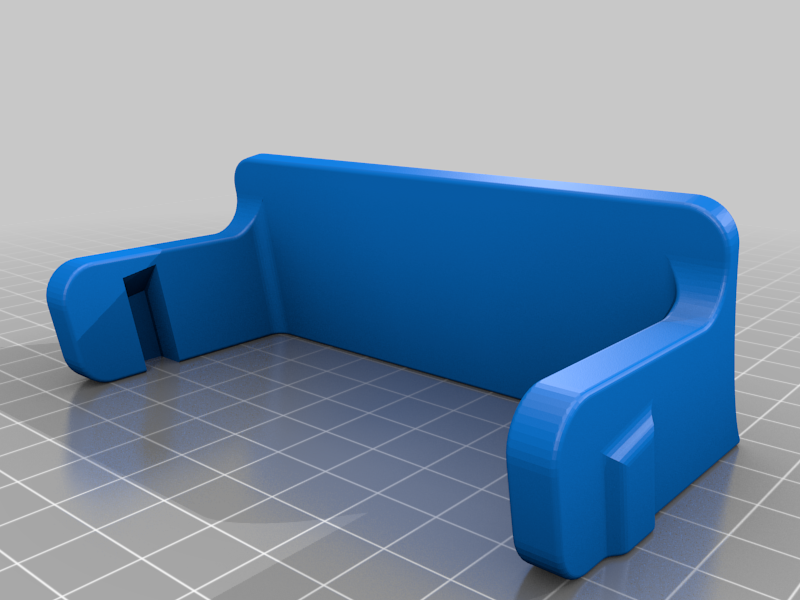

# Interactive-Educational-Robot

Final-year project repo.

## Project Context
The project is designed within an educational framework where the goal is to introduce children (aged 6 and above) to the fundamentals of programming and robotics. This interactive robot will be used in classroom settings and at home to stimulate logical thinking, creativity, and problem-solving skills. The robot’s design will focus on simplicity and intuitiveness, ensuring it is accessible for young learners.

## 3D printed design

- Gripper Attachment

- Wall follow IR mount

- Head

- Wheel 1

- Line follow sensor mount

- Rear swivel

- Dozer blade

- Wheel 2

- Base

- Dozer blade

